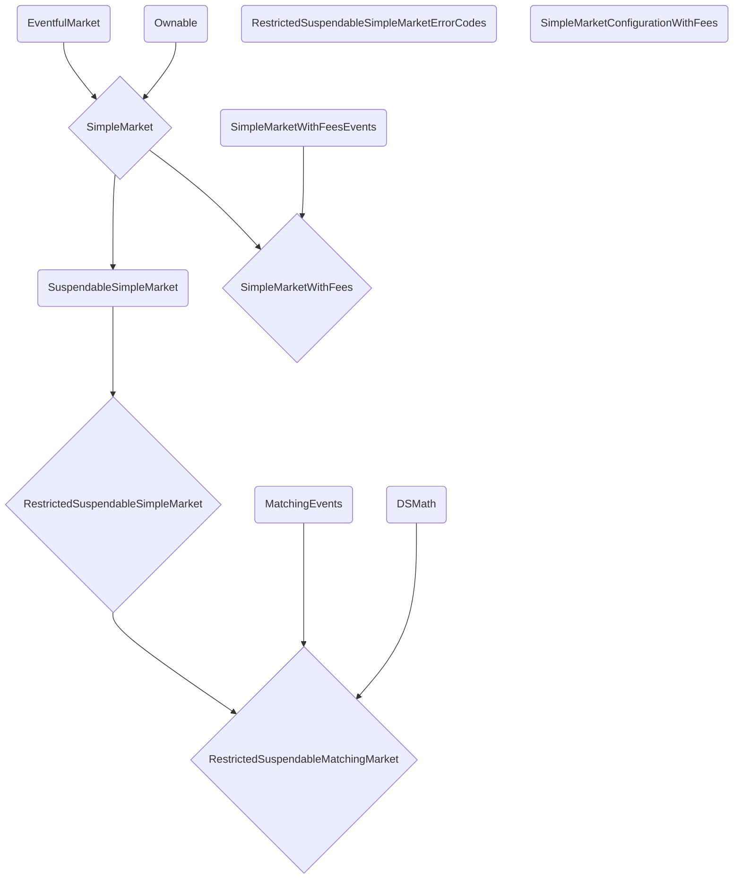

# Contracts

```mermaid
graph TD;
EV(EventfulMarket)


OW(Ownable)
SMPL{SimpleMarket}
SUSPSMPL(SuspendableSimpleMarket)

RER(RestrictedSuspendableSimpleMarketErrorCodes)
RSUSPSMPL{RestrictedSuspendableSimpleMarket}
MEV(MatchingEvents)
DSM(DSMath)
RSMM{RestrictedSuspendableMatchingMarket}


SMWF{SimpleMarketWithFees}

EVSMWF(SimpleMarketWithFeesEvents)

CFGSMWF(SimpleMarketConfigurationWithFees)


EV --> SMPL

OW --> SMPL

SMPL --> SUSPSMPL

SUSPSMPL --> RSUSPSMPL

RSUSPSMPL --> RSMM
MEV --> RSMM
DSM --> RSMM


EVSMWF --> SMWF
SMPL --> SMWF

```