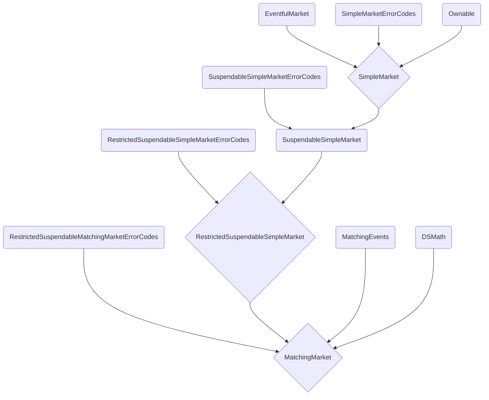

# Contracts

```mermaid
graph TD;
EV(EventfulMarket)
ER(SimpleMarketErrorCodes)
OW(Ownable)
SMPL{SimpleMarket}
SUSPSMPL(SuspendableSimpleMarket)
ERRSUSP(SuspendableSimpleMarketErrorCodes)
RER(RestrictedSuspendableSimpleMarketErrorCodes)
RSUSPSMPL{RestrictedSuspendableSimpleMarket}
MEV(MatchingEvents)
DSM(DSMath)
MM{MatchingMarket}
ERRMM(RestrictedSuspendableMatchingMarketErrorCodes)
EV --> SMPL
ER --> SMPL
OW --> SMPL
ERRSUSP --> SUSPSMPL
SMPL --> SUSPSMPL
RER --> RSUSPSMPL
SUSPSMPL --> RSUSPSMPL
ERRMM --> MM
RSUSPSMPL --> MM
MEV --> MM
DSM --> MM

```